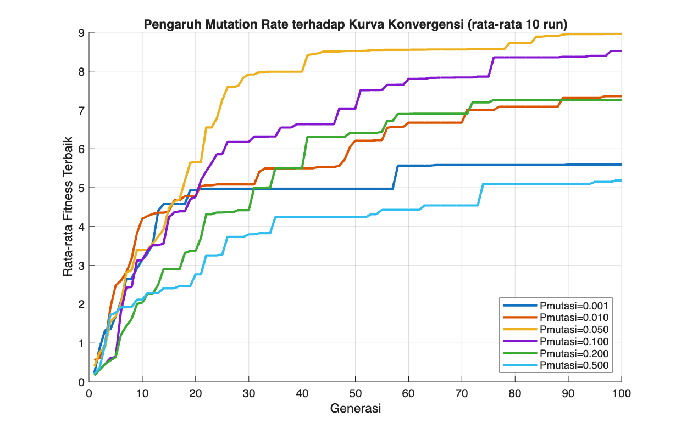
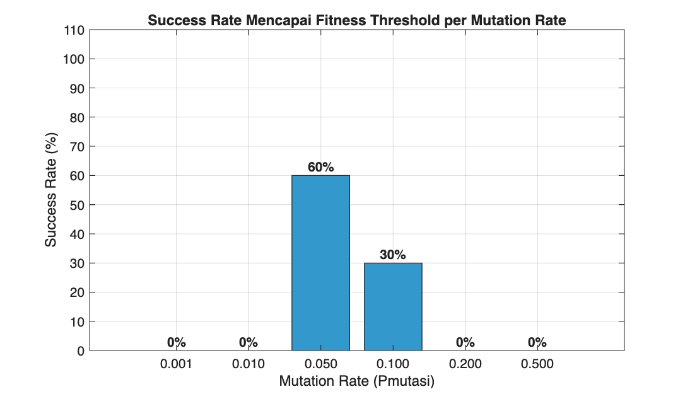
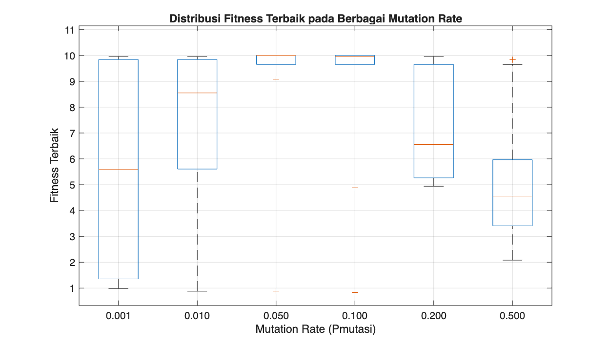
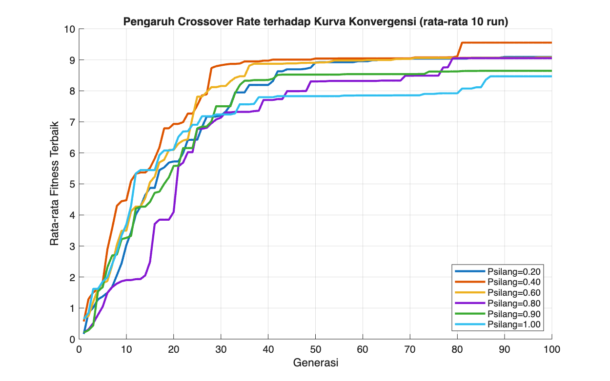
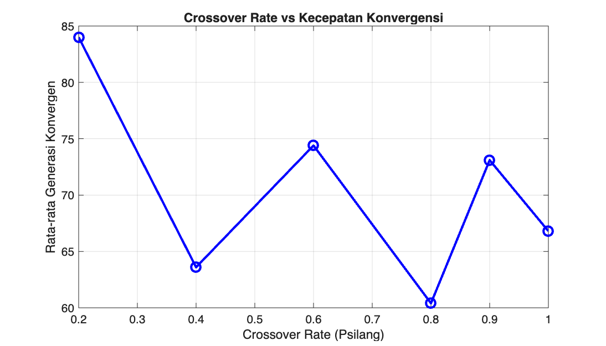
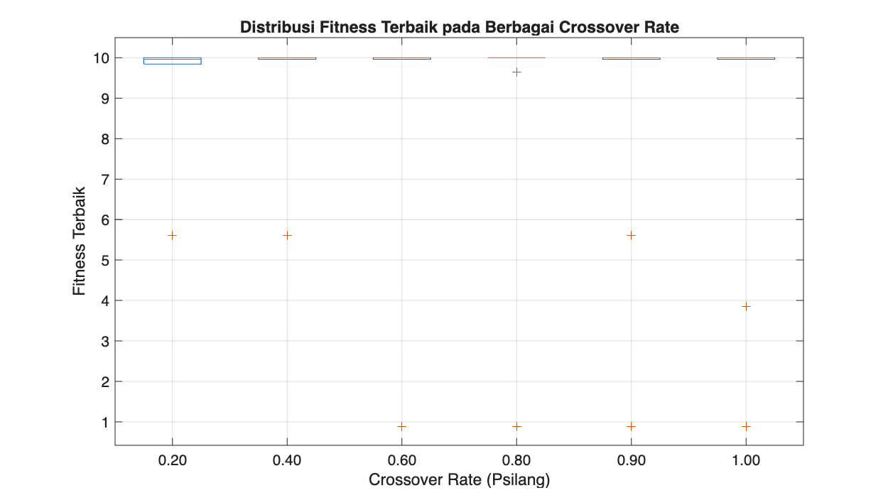
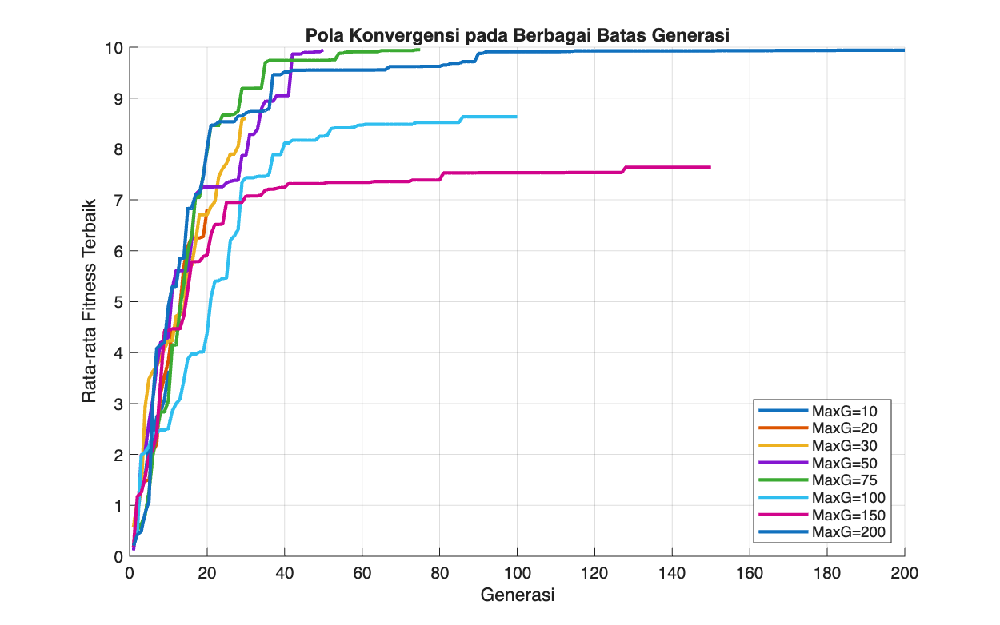
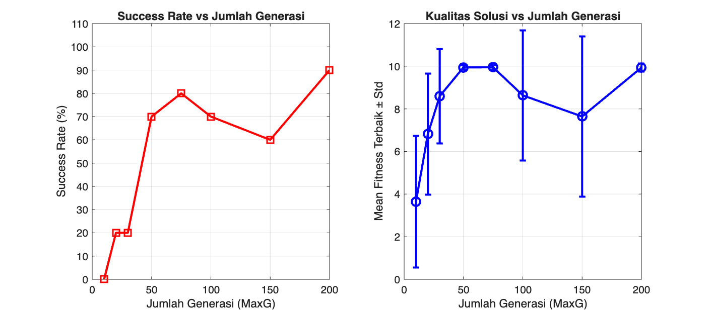

# 🧬 GA Exploration — Eksplorasi Hyperparameter Genetic Algorithm

> **Tugas HandsOn**: Eksplorasi Hyperparameter Genetic Algorithm  
> **Studi Kasus**: Minimasi fungsi `h(x₁,x₂) = 1000(x₁ − 2x₂)² + (1 − x₁)²`  
> Minimum global: `h = 0` pada `x₁ = 1`, `x₂ = 0.5`  
> **Program Studi**: Teknik Informatika (AI) — Universitas Hasanuddin

---

## 📂 Struktur Repository

```
├── AGstandar2D.m                # ✅ Program utama dari buku (grafis 2D)
├── AGstandar3D.m                # ✅ Program utama dari buku (grafis 3D)
├── InisialisasiPopulasi.m       # Bangkitkan populasi awal (binary random)
├── DekodekanKromosom.m          # Dekode kromosom biner → nilai real
├── EvaluasiIndividu.m           # Hitung fitness individu
├── LinearFitnessRanking.m       # Skalakan fitness ke ranking linear
├── RouletteWheel.m              # Seleksi proporsional roulette-wheel
├── PindahSilang.m               # One-point crossover
├── Mutasi.m                     # Bit-flip mutation
├── Eksperimen1_MutationRate.m   # 🔬 Analisis pengaruh mutation rate
├── Eksperimen2_CrossoverRate.m  # 🔬 Analisis pengaruh crossover rate
├── Eksperimen3_JumlahGenerasi.m # 🔬 Analisis pengaruh jumlah generasi
├── Eks1_KurvaKonvergensi.png
├── Eks1_SuccessRate.png
├── Eks1_BoxplotFitness.png
├── Eks2_KurvaKonvergensi.png
├── Eks2_CrossoverVsGenKonvergen.png
├── Eks2_BoxplotFitness.png
├── Eks3_PatterkKonvergensi.png
└── Eks3_KualitasVsGenerasi.png
```

---

## ⚙️ Parameter Baseline (dari Buku)

| Parameter   | Nilai         | Keterangan                      |
|-------------|---------------|---------------------------------|
| `UkPop`     | 200           | Jumlah kromosom dalam populasi  |
| `Nbit`      | 10            | Bit per variabel                |
| `JumGen`    | 20            | Total gen (Nbit × Nvar)         |
| `Ra / Rb`   | 5.12 / -5.12  | Batas interval pencarian        |
| `Psilang`   | 0.8           | Probabilitas crossover          |
| `Pmutasi`   | 0.05          | Probabilitas mutasi             |
| `MaxG`      | 100           | Jumlah generasi maksimum        |
| `BilKecil`  | 0.1           | Konstanta penghindari div/0     |

---

## ▶️ Cara Menjalankan

1. Buka MATLAB
2. Set *Current Directory* ke folder repo ini
3. Jalankan program utama dari buku:
   ```matlab
   AGstandar2D
   ```
4. Jalankan masing-masing eksperimen:
   ```matlab
   Eksperimen1_MutationRate
   Eksperimen2_CrossoverRate
   Eksperimen3_JumlahGenerasi
   ```

> Setiap eksperimen otomatis menyimpan grafik `.png` dan data `.mat`.  
> Setiap konfigurasi dijalankan **10 kali** (nRun=10) untuk rata-rata dan std.

---

## 📊 Hasil Eksperimen

### Eksperimen 1 — Pengaruh Mutation Rate
`Psilang=0.8, MaxG=100, nRun=10`

| Pmutasi | Mean Fitness | Std    | Success Rate |
|---------|-------------|--------|--------------|
| 0.001   | 5.5945      | 3.9345 | 0%           |
| 0.010   | 7.3546      | 3.0165 | 0%           |
| **0.050** | **8.9580** | 2.8543 | **⭐ 60%** |
| 0.100   | 8.5191      | 3.1399 | 30%          |
| 0.200   | 7.2577      | 2.1662 | 0%           |
| 0.500   | 5.1879      | 2.6507 | 0%           |

**Temuan**: Pola unimodal tajam. `Pmutasi=0.05` optimal. Terlalu rendah → premature convergence. Terlalu tinggi → random search.





---

### Eksperimen 2 — Pengaruh Crossover Rate
`Pmutasi=0.05, MaxG=100, nRun=10`

| Psilang | Mean Fitness | Std    | Avg Gen Konvergen | Success Rate |
|---------|-------------|--------|------------------|--------------|
| 0.20    | 9.0934      | 1.8389 | 84.0             | 40%          |
| 0.40    | 9.5526      | 1.3870 | 63.6             | 70%          |
| 0.60    | 9.0757      | 2.8808 | 74.4             | 60%          |
| **0.80** | 9.0529    | 2.8748 | **60.4**         | **⭐ 80%** |
| 0.90    | 8.6442      | 3.0580 | 73.1             | 70%          |
| 1.00    | 8.4683      | 3.2938 | 66.8             | 70%          |

**Temuan**: Crossover rate mempengaruhi kecepatan lebih dari kualitas akhir. `Psilang=0.8` optimal (success rate 80%, konvergen tercepat 60.4 gen).





---

### Eksperimen 3 — Pengaruh Jumlah Generasi
`Psilang=0.8, Pmutasi=0.05, nRun=10`

| MaxG | Mean Fitness | Std    | Success Rate | Keterangan              |
|------|-------------|--------|--------------|-------------------------|
| 10   | 3.6464      | 3.0866 | 0%           | Terlalu dini            |
| 20   | 6.8167      | 2.8351 | 20%          | Mulai konvergen         |
| 30   | 8.5977      | 2.2187 | 20%          | Peningkatan signifikan  |
| 50   | 9.9455      | 0.1142 | 70%          | ⭐ Loncatan kualitas    |
| 75   | 9.9495      | 0.1155 | 80%          | ⭐ Mean fitness terbaik |
| 100  | 8.6325      | 3.0526 | 70%          | Variansi naik (stokastik)|
| 150  | 7.6409      | 3.7624 | 60%          | Anomali stokastik        |
| 200  | 9.9398      | 0.1902 | 90%          | ⭐ Success rate tertinggi|

**Temuan**: Ambang kritis di sekitar **MaxG=50**. Fluktuasi pada MaxG=100/150 adalah artefak stokastik (nRun=10). MaxG=75–100 sudah memadai secara praktis.




---

## 🧠 Ringkasan Temuan

| Hyperparameter   | Nilai Optimal      | Sensitivitas | Catatan                                    |
|------------------|--------------------|-------------|---------------------------------------------|
| Mutation Rate    | 0.05               | **TINGGI**  | Pola unimodal tajam, kesalahan → 0% success |
| Crossover Rate   | 0.80               | Moderat     | Plateau lebar, pengaruh utama pada kecepatan|
| Jumlah Generasi  | ≥50 (ideal 75–200) | Moderat     | Ambang kritis di gen ke-50                  |

---

## 📖 Referensi

- Buku: *Algoritma Genetika dalam MATLAB*, Bab 3.2 — Implementasi AG Standar
- Holland, J. H. (1975). *Adaptation in Natural and Artificial Systems*. University of Michigan Press.
- Goldberg, D. E. (1989). *Genetic Algorithms in Search, Optimization, and Machine Learning*. Addison-Wesley.

---

*Teknik Informatika — Universitas Hasanuddin*
